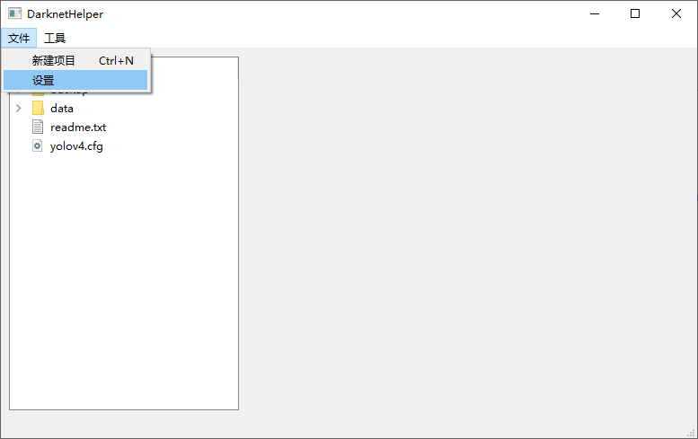
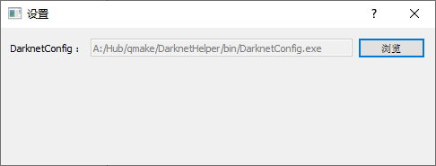
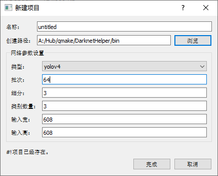
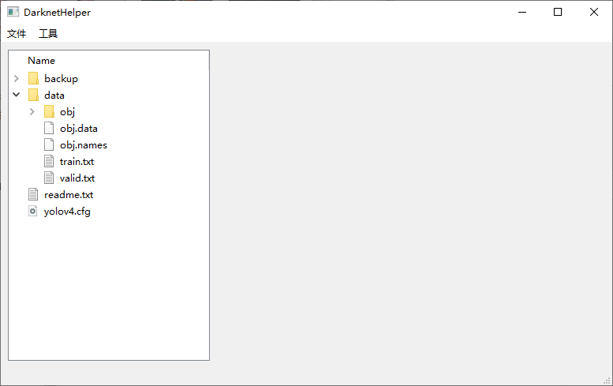
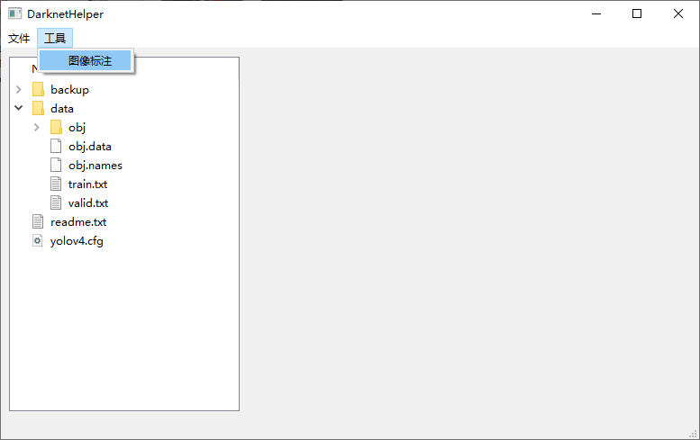
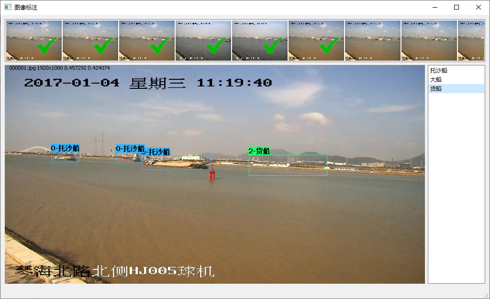

# DarknetHelper
DarknetHelper 是一款 yolov4 项目创建工具和标注工具。

可以方便的创建 yolov4 和 yolov4-tiny 项目目录，并进行标注。

标注完成后可直接使用 darknet.exe 工具进行训练。

## 配置
设置 DarknetConfig.exe 文件位置。

> 该工具是一个命令行工具，用于创建 yolov4 和 yolov4-tiny 项目目录，生成的配置文件会自动根据输入的参数进行修改。

## 新建工程
1. 使用向导新建项目目录，输入相关参数后点击完成即可。

新建完成后项目目录。

## 标注图像
1. 把需要训练的正负样本数据放入 /data/obj 目录。
2. 打开标注工具进行标注

标注工具主要分为三个工作区：
* 数据区
* 标签区
* 标注区

1. 数据区
数据区显示 `/data/obj` 目录中的所有图像数据，其中存在对应 *.txt 文件时，图像上会显示 `绿色对勾`。

> 确保所有图像存在 `绿色对勾` 负样本也需要这样。

2. 标签区
标签区对应于 `/data/obj.names` 文件，双击标签区中的文本可以编辑该标签数据，在图像标注窗口关闭时会自动保存。

3. 标注区
标注区用来标注图像数据

鼠标移动到标注框时，会加粗显示，此时使用 `Ctrl+C` 快捷键可以清楚该标注框。
如果需要隐藏标签，可使用 `Ctrl+H` 快捷键隐藏标注框标签。

> 标注框的颜色会自动设置，无需要手动干预，不同标签会使用不同颜色。

